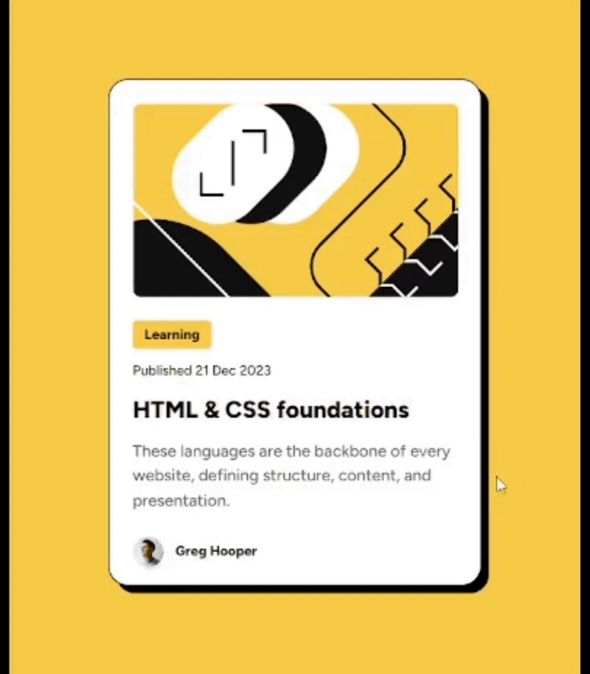

# Frontend Mentor - Blog preview card solution

This is a solution to the [Blog preview card challenge on Frontend Mentor](https://www.frontendmentor.io/challenges/blog-preview-card-ckPaj01IcS). Frontend Mentor challenges help you improve your coding skills by building realistic projects. 

## Table of contents

- [Overview](#overview)
  - [Screenshot](#screenshot)
  - [Links](#links)
- [Author](#author)
- [Acknowledgments](#acknowledgments)

## Overview

### Screenshot

### Links

- Solution URL: [GitHub]([https://your-solution-url.com](https://github.com/Pavlinova/blog-preview-card)
- Live Site URL: [GitHub Pages](https://pavlinova.github.io/blog-preview-card/)

## Author

- Frontend Mentor - [@Pavlinova](https://www.frontendmentor.io/profile/Pavlinova)

## Acknowledgments

Thanks to the Frontend Mentor team for the high-quality assignments and for teaching modern web development tools.

